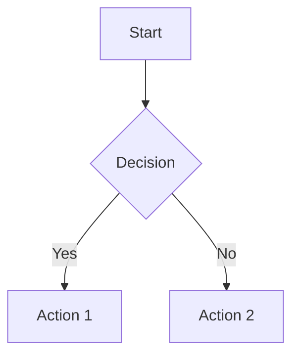
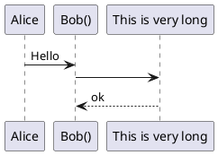
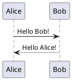

# EmbeddingBag

##  产品支持情况

| 产品 | 是否支持 |
| ---- | :----:|
|昇腾910_95 AI处理器|×|
|Atlas A3 训练系列产品/Atlas A3 推理系列产品|√|
|Atlas A2 训练系列产品/Atlas 800I A2 推理产品/A200I A2 Box 异构组件|√|
|Atlas 200I/500 A2推理产品|×|
|Atlas 推理系列产品|√|
|Atlas 训练系列产品|√|
|Atlas 200/300/500 推理产品|×|

## 功能说明

- 算子功能：根据indices从weight中获得一组被聚合的数，然后根据offsets的偏移和mode指定的聚合模式对获取的数进行max、sum、mean聚合。其余参数则更细化了计算过程的控制。
  - shape推导方式如下：
    假设:
    ```
    weight的shape为(numWeight, embeddingDim)
    indices的shape为(indices)
    offsets的shape为(offsets)
    ```
    - 当mode为sum模式：
      ```
      y的shape 为 include_last_offset ? (offsets - 1, embeddingDim) : (offsets, embeddingDim)
      offset2bag的shape 为 (indices,)
      bag_size的shape 为 include_last_offset ? (offsets - 1) : (offsets,)
      max_indices的shape 为 include_last_offset ? (offsets - 1) : (offsets,)
      ```
    - 当mode为mean模式：
      ```
      y的shape 为 include_last_offset? (offsets - 1, embeddingDim) : (offsets, embeddingDim)
      offset2bag的shape 为 (indices,)
      bag_size的shape 为 include_last_offset ? (offsets - 1) : (offsets,)
      max_indices的shape 为 include_last_offset ? (offsets - 1) : (offsets,)
      ```
    - 当mode为max模式：
      ```
      y的shape 为 include_last_offset ? (offsets - 1, embeddingDim) : (offsets, embeddingDim)
      offset2bag的shape 为 (indices,)
      bag_size的shape 为 include_last_offset ? (offsets - 1) : (offsets,)
      max_indices的shape 为 include_last_offset ? (offsets - 1, embeddingDim) : (offsets, embeddingDim)
      ```

## 参数说明

<table style="undefined;table-layout: fixed; width: 1300px"><colgroup>
  <col style="width: 50px">
  <col style="width: 60px">
  <col style="width: 180px">
  <col style="width: 100px">
  <col style="width: 40px">
  </colgroup>
  <thead>
    <tr>
      <th>参数名</th>
      <th>输入/输出/属性</th>
      <th>描述</th>
      <th>数据类型</th>
      <th>数据格式</th>
    </tr></thead>
  <tbody>
    <tr>
      <td>weight</td>
      <td>输入</td>
      <td>词嵌入矩阵，包含所有词的嵌入向量。</td>
      <td>FLOAT、FLOAT16、BFLOAT16</td>
      <td>ND</td>
    </tr>
    <tr>
      <td>indices</td>
      <td>输入</td>
      <td>包含索引的张量，指定要从weight中提取哪些词的嵌入向量。</td>
      <td>INT32、INT64</td>
      <td>ND</td>
    </tr>
    <tr>
      <td>offsets</td>
      <td>可选输入</td>
      <td>用于将indices分割成多个bag的偏移量张量。</td>
      <td>INT32、INT64</td>
      <td>ND</td>
    </tr>
     <tr>
      <td>per_sample_weights</td>
      <td>可选输入</td>
      <td>指定样本权重。</td>
      <td>FLOAT、FLOAT16、BFLOAT16</td>
      <td>ND</td>
    </tr>
     <tr>
      <td>y</td>
      <td>输出</td>
      <td>词嵌入矩阵聚合后的结果。</td>
      <td>INT32、INT64</td>
      <td>ND</td>
    </tr>
    <tr>
      <td>offset2bag</td>
      <td>输出</td>
      <td>bag的起始偏移。</td>
      <td>INT32、INT64</td>
      <td>ND</td>
    </tr>
    <tr>
      <td>bag_size</td>
      <td>输出</td>
      <td>每个bag的大小。</td>
      <td>INT32、INT64</td>
      <td>ND</td>
    </tr>
    <tr>
      <td>max_indices</td>
      <td>输出</td>
      <td>当mode为max时，词嵌入向量最大值所在的行。</td>
      <td>INT32、INT64</td>
      <td>ND</td>
    </tr>
    <tr>
      <td>mode</td>
      <td>可选属性</td>
      <td><ul><li>用于控制聚合模式。</li><li>默认值为"mean"。</li></td>
      <td>String</td>
      <td>-</td>
    </tr>
    <tr>
      <td>scale_grad_by_freq</td>
      <td>可选属性</td>
      <td><ul><li>用于控制是否根据词频缩放梯度。</li><li>默认值为false。</li></td>
      <td>Bool</td>
      <td>-</td>
    </tr>
    <tr>
      <td>sparse</td>
      <td>可选属性</td>
      <td><ul><li>用于控制稀疏模式。</li><li>默认值为false。</li></td>
      <td>Bool</td>
      <td>-</td>
    </tr>
    <tr>
      <td>include_last_offset</td>
      <td>可选属性</td>
      <td><ul><li>控制是否包含最后的偏移。</li><li>默认值为false。</li></td>
      <td>Bool</td>
      <td>-</td>
    </tr>
    <tr>
      <td>padding_idx</td>
      <td>可选属性</td>
      <td><ul><li>控制是否包含最后的偏移。</li><li>默认值为-1。</li></td>
      <td>Int</td>
      <td>-</td>
    </tr>
  </tbody></table>

- Atlas 训练系列产品：不支持BFLOAT16。

## 约束说明

无

## 调用说明

| 调用方式 | 调用样例                                                                   | 说明                                                           |
|--------------|------------------------------------------------------------------------|--------------------------------------------------------------|
| aclnn调用 | [test_aclnn_embedding_bag](./examples/test_aclnn_embedding_bag.cpp) | 通过[aclnnEmbeddingBag](./docs/aclnnEmbeddingBag.md)接口方式调用EmbeddingBag算子。 |
| 图模式调用 | [test_geir_embedding_bag](./examples/test_geir_embedding_bag.cpp)   | 通过[算子IR](./op_graph/embedding_bag_proto.h)构图方式调用EmbeddingBag算子。 |




```Alice -> "Bob()" : Hello
"Bob()" -> "This is very long" as Long
' You can also declare:
' "Bob()" -> Long as "This is very long"
Long --> "Bob()" : ok
```





Alice -> "Bob()" : Hello
"Bob()" -> "This is very long" as Long
' You can also declare:
' "Bob()" -> Long as "This is very long"
Long --> "Bob()" : ok





2343242342343213123123
123123234234234324241231231
12321312
www.baidu.com

这是一句在 `` 符号里面的话：`就是这句话`对吧 `对吧`323333323iuyiuhi
这是一句在 `` 符号里面的话：`就是这句话`对吧`对吧`
# 这是一个标题，每个分支都有，随便改234` 2 `3432666666623423423423424wefwefwe66`2342346`66666661`66`66wfwefew3242wefwefwef34234234234safsafsadf23423424
这是一条只有mian分支才有的专属文案，别改123123213
这是一条只有main分支才有的专属文案，可1`以`改we2342424242424fewfwefewfwefwefw12312313efwe3242234242434234fwefwef234234234wqwerqwrefwe
这是一条所有分支都相同的文案A-别改
这是一条所有分支都相同的文案B-别改
这是一条所有分支都相同的文案C-别改
234234234
123123123
## wfwe_def
# www.baidu.com、www.gitcode.com
# www.baidu.com、
# 、www.baidu.com
# www.baid、u.com

https://www.dededededededede

PR的检视意见评论同步到commit里面123
PR的检视意见评论同步到commit里面123
PR的检视意见评论同步到commit里面123
PR的检视意见评论同步到commit里面123234
PR的检视意见评论同步到commit里面123
PR的检视意见评论同步到commit里面234
PR的检视意见评论同步到commit里面234

这是第二个commit了
这是第二个commit了
这是第二个commit了
这是第二个commit了
这是第二个commit了


